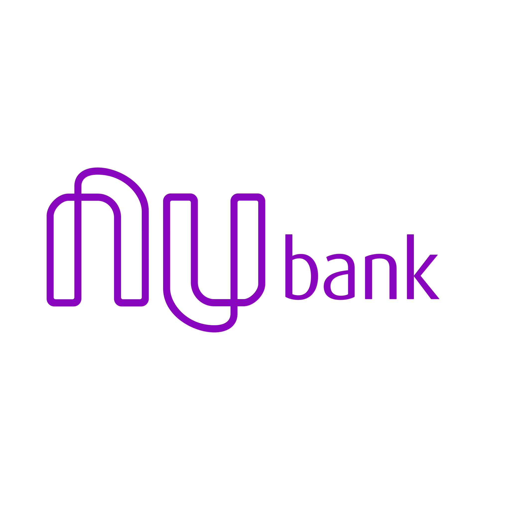
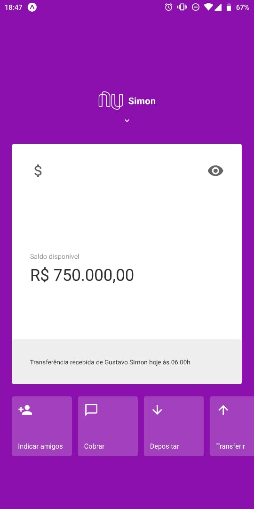
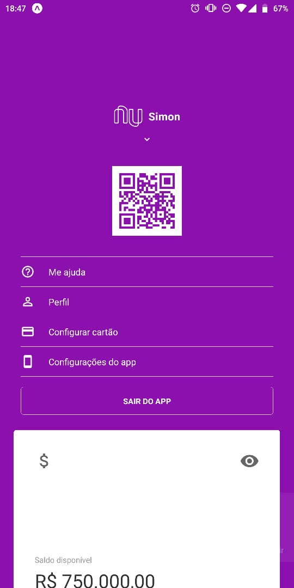
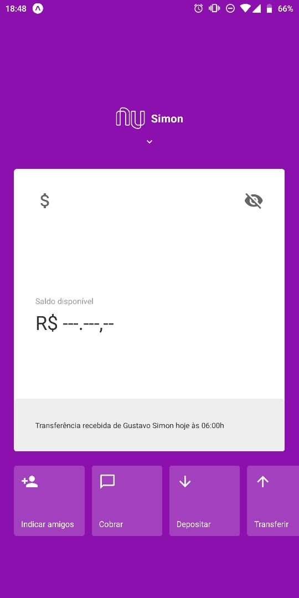

<h1 align="center">
    
</h1>

<h4 align="center">
    Nubank mobile app clone
</h4>

---

<p align="center">
  

  

  

  
</p>

<h2>📔 Description</h2>

## Nubank mobile app clone

`Mobile`

<details>
  <summary>See</summary>





</details>

<h2>🚀 Technologies</h2>

- [Typescript](https://www.typescriptlang.org/)
- [Expo](https://expo.io/)
- [ReactNative](https://reactnative.dev/)
- [ReactNativeQRCodeSvg](https://www.npmjs.com/package/react-native-qrcode-svg)
- [Styled Components](https://styled-components.com/)
- [ESLint](https://eslint.org/)

---

<h2>❓ How to use</h2>

`Mobile`

```bash
# Clone this repository
$ git clone https://github.com/gustavosimon/nubank-interface/tree/master/mobile

# Go into the repository
$ cd nubank-interface/mobile

# Install dependencies for the mobile
$ yarn

# Start React Native Server in Android
$ yarn android

# Start React Native Server in IOS
$ yarn ios

# Open EXPO in your cellphone and scan the QRCode
```

Made by [Gustavo Simon!](https://www.linkedin.com/in/gustavo-simon)

[Rocketseat](https://rocketseat.com.br/)
